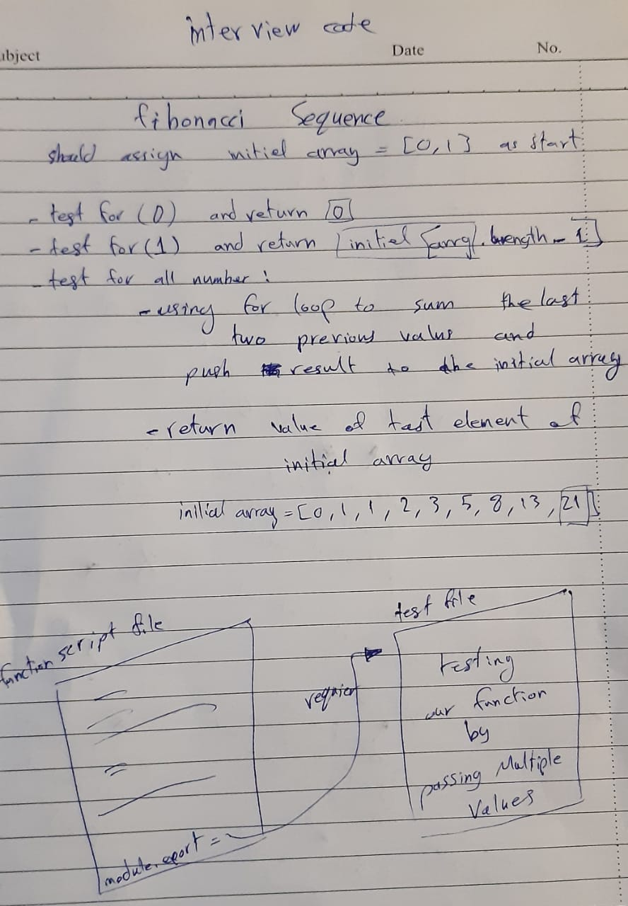
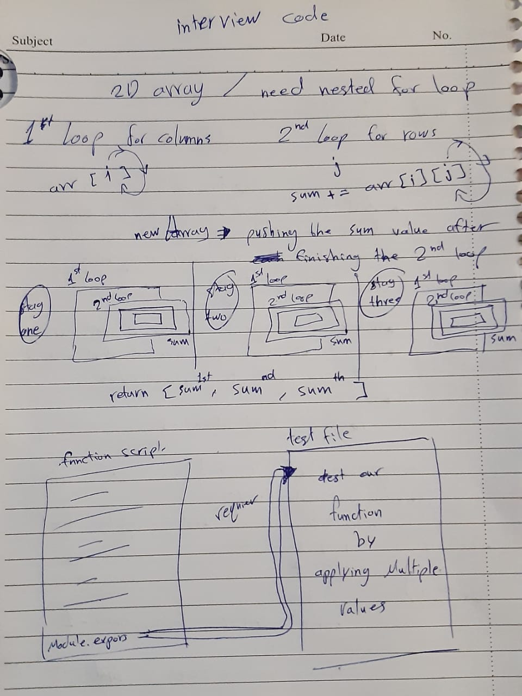

# Challenge Summary
<!-- Short summary or background information -->
should write two functions first one to sum all elements of each row alone from a matrix array. the second function should return value as Fibonacci algorithm from given input number.

## Challenge Description
<!-- Description of the challenge -->
* first challenge:<br>
write a function to add up the sum of each row in a matrix of arbitrary size, and return an array with the appropriate values. Negative values are possible.

* first challenge:<br>
write a function to accepts an integer, and returns the nth number in the Fibonacci sequence.

## Approach & Efficiency
<!-- What approach did you take? Why? What is the Big O space/time for this approach? -->
for the first function a used nested for-loop to reach all elements. the second function i used if-statment with for-loop.

## UML



## Solution
<!-- Embedded whiteboard image -->
```
function sumEachRowInMatrix(arr) {
  let newArray = [], sumEachRow = 0;
  for(let i = 0 ; i < arr.length ; i++){
    for(let j = 0 ; j < arr[i].length ; j++){
      sumEachRow += arr[i][j];
    }
    newArray.push(sumEachRow);
    sumEachRow = 0;
  }
  return newArray;
}

function fibonacciSequence(num){
  let number = num, initielArray = [0, 1];
  if (num === 0){
    return 0;
  }else if (num === 1){
    return initielArray[initielArray.length - 1];
  }else{
    for(let i = 2 ; i <= number ; i++){
      initielArray.push(initielArray[i - 2] + initielArray[i - 1]);
    }
    return initielArray[initielArray.length - 1];
  }
}
```
