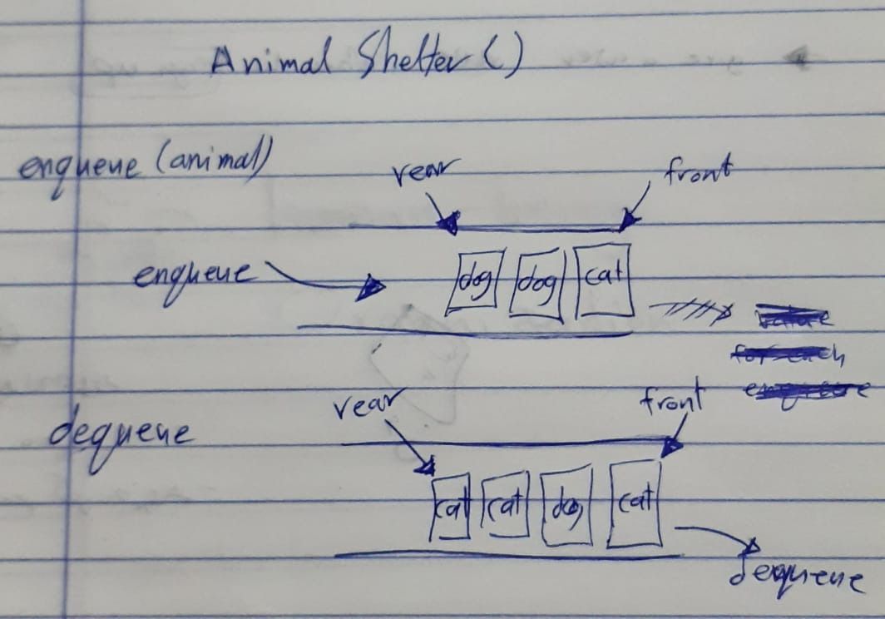

# Challenge Summary
<!-- Short summary or background information -->
write function to return value of node, with given number counted from the end of the list, and Implementing two these methods `enqueue(animal)`, `dequeue(pref)`.

## Challenge Description
<!-- Description of the challenge -->
Create a class called AnimalShelter which holds only dogs and cats. The shelter operates using a first-in, first-out approach. 
* `enqueue(animal)`: adds `animal` to the shelter. `animal` can be either a dog or a cat object.
* `dequeue(pref)`: returns either a dog or a cat. If `pref` is not `"dog"` or `"cat"` then return null.

<!-- ## Approach & Efficiency -->
<!-- What approach did you take? Why? What is the Big O space/time for this approach? -->

and the (Big O) for the `enqueue()` is O(n), and for the `dequeue()` is O(n).

<!-- ## UML  -->

