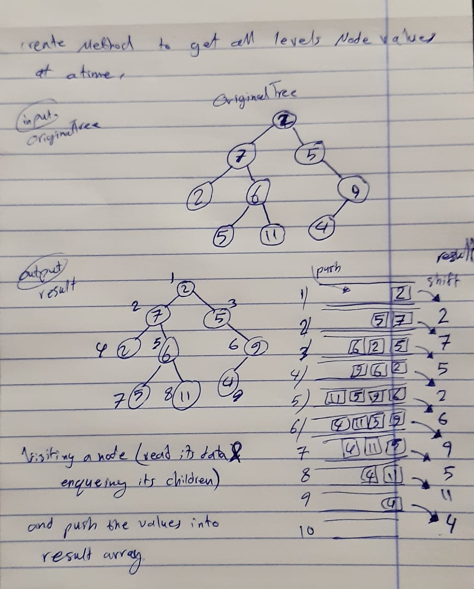

# breadth first traversal

## summary
<!-- Short summary or background information -->
Create function to export tree nodes values using Breadth-first approach.

## Challenge
<!-- Description of the challenge -->
Write a breadth first traversal method which takes a Binary Tree as its unique input. Without utilizing any of the built-in methods available to your language, traverse the input tree using a Breadth-first approach, and return a list of the values in the tree in the order they were encountered.

## Approach & Efficiency
<!-- What approach did you take? Why? What is the Big O space/time for this approach? -->
Breadth-first search involves search through a tree one level at a time. so I traverse through one entire level of children nodes first, before moving on to traverse through the grandchildren nodes. I need to keep a reference to all the children nodes of every node that we visit. The key to this working so well is the very nature of the queue structure. Queues follow the first-in, first-out (FIFO) principle, which means that whatever was enqueued first is the first item that will be read and removed from the queue. 
**big O notation will be equal to O(n)**

## UML
<!-- Description of each method publicly available in each of your trees -->
