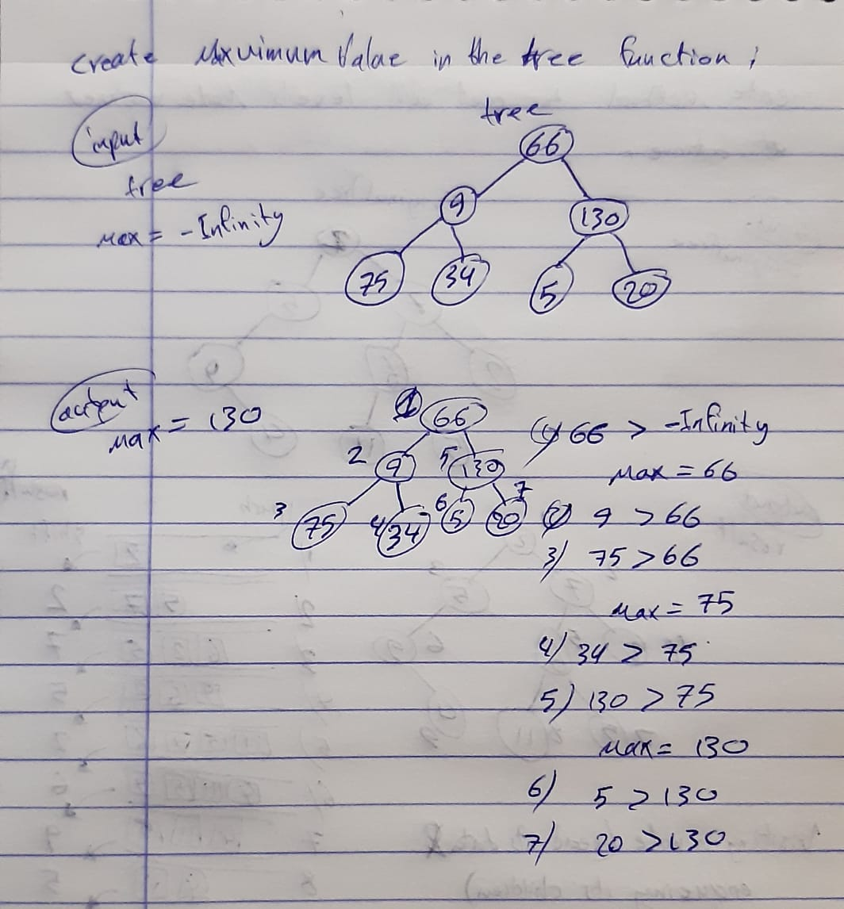

# Challenge Summary
find maximum binary tree function.

## Challenge Description
Using `BinaryTree ` class, write an instance method called `find-maximum-value`. Without utilizing any of the built-in methods available to your language, return the maximum value stored in the tree. You can assume that the values stored in the Binary Tree will be numeric.

## Approach & Efficiency
I first define variable max that will hold `-Infinity` value. Then, using preorder way to traverse through tree to find the largest node. Compare it with node value and store the maximum of two in a variable max. In the end, max will have the largest node. 
**the Big O notation will be O(n).**

## UML

