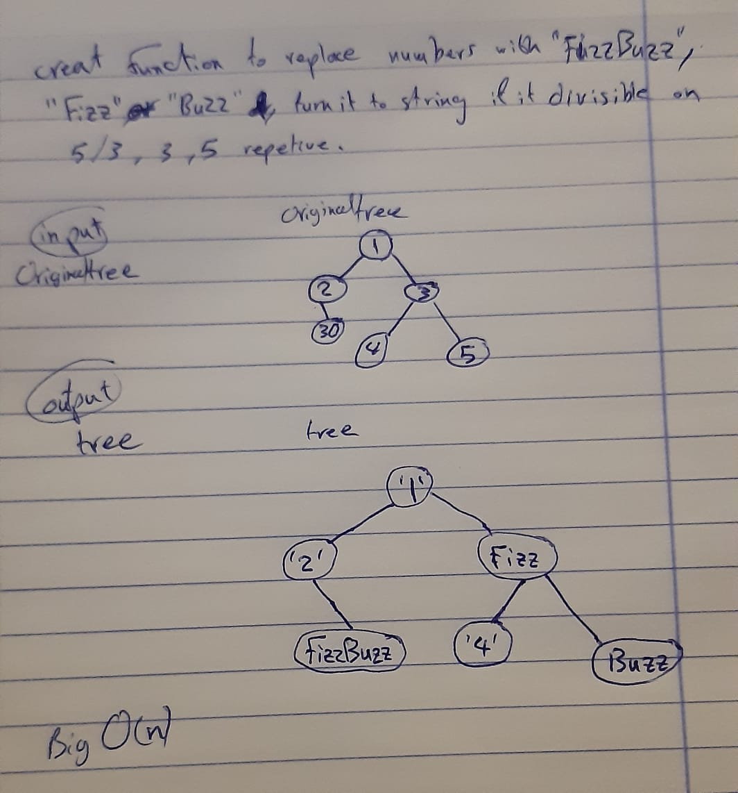

# Challenge Summary
<!-- Short summary or background information -->
Write a function called `FizzBuzzTree` which takes a tree as an argument to determine whether or not the value of each node is divisible by 3, 5 or both. and return the new tree.

## Challenge Description
<!-- Description of the challenge -->
Write a function called `FizzBuzzTree` which takes a tree as an argument.
Without utilizing any of the built-in methods available to your language, determine whether or not the value of each node is divisible by 3, 5 or both. Create a new tree with the same structure as the original, but the values modified as follows:
* If the value is divisible by 3, replace the value with “Fizz”
* If the value is divisible by 5, replace the value with “Buzz”
* If the value is divisible by 3 and 5, replace the value with “FizzBuzz”
* If the value is not divisible by 3 or 5, simply turn the number into a String. 
finaly return the new tree.

## Approach & Efficiency
<!-- What approach did you take? Why? What is the Big O space/time for this approach? -->
by using recursive function to move around all nodes in the tree as preorder method. also using if statment to test the values of the nodes.  and the **Big O notation will be O(n)** .

## UML
<!-- Embedded whiteboard image -->

