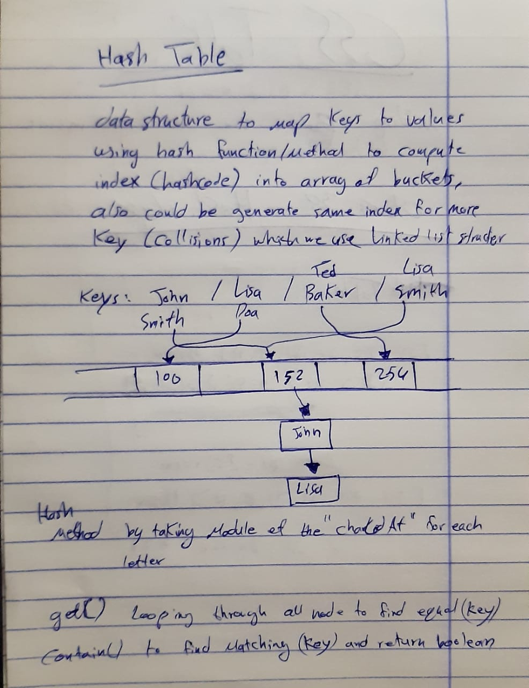

# Hashtables
<!-- Short summary or background information -->
Implement a Hashtable with these methods `add()`, `get()`, `contain()` and `hash()`.

## Challenge
<!-- Description of the challenge -->
Implement a Hashtable with the following methods: 
1. `add()`: takes in both the key and value. This method should hash the key, and add the key and value pair to the table, handling collisions as needed.
1. `get()`: takes in the key and returns the value from the table.
1. `contain()`: takes in the key and returns a boolean, indicating if the key exists in the table already.
1. `hash()`: takes in an arbitrary key and returns an index in the collection.

## Approach & Efficiency
<!-- What approach did you take? Why? What is the Big O space/time for this approach? -->
my approach to buile `get()` method was by hashing the input key and start to loop over all the nodes thats attached to that index to find tthe match key and return its value, also `contain()` method same process but changing the return to be boolean value as false or ture. 
**Big O notation will be O(1) for the best case, and O(n) for the worst case**

## UML
<!-- Description of each method publicly available in each of your hashtable -->
 