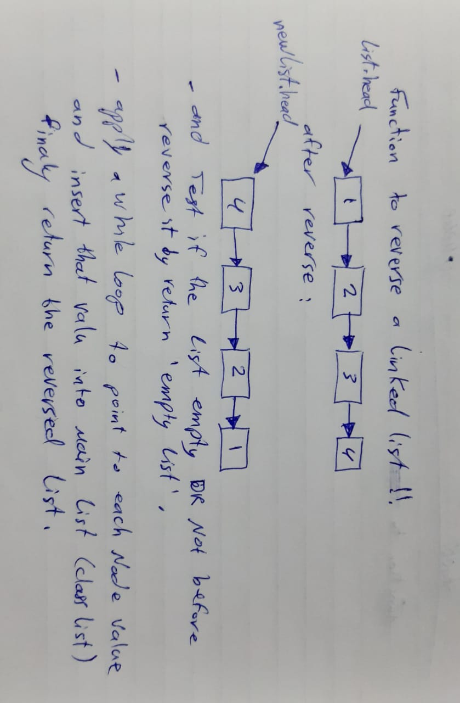

# Challenge Summary
<!-- Short summary or background information -->
Write a function reverse a linked Lists like this:<br>
`head->[3]->[2]->[1]` => `head->[1]->[2]->[3]`<br>

## Challenge Description
<!-- Description of the challenge -->
Write a function called `reverse` which takes a linked lists as arguments. and return the same list but in reverse order. You have access to the Node class and all the properties on the Linked List class as well as the methods created in previous challenges.

## Approach & Efficiency
<!-- What approach did you take? Why? What is the Big O space/time for this approach? -->
i started to assign each value of each list one at a time into main list created by class LinkedList using built-in method `insert`, the solution takes O(n) time and uses O(n) space.

# UML




## Solution
<!-- Embedded whiteboard image -->
```
reverse(li) {
  if(!li.head) return 'empty list';
  let currentNode = li.head;
  let newList = new LinkedList();
  while (currentNode) {
    newList.insert(currentNode.value);
    currentNode = currentNode.next;
  }
  return newList;
}
```
