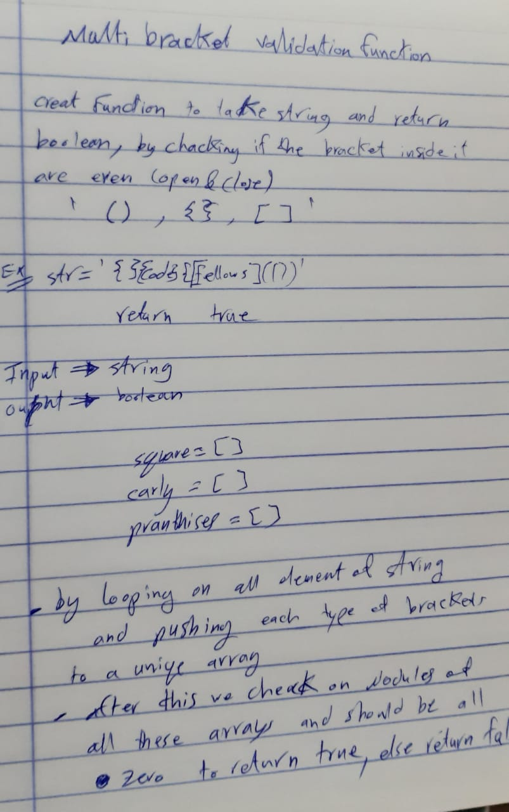

# Challenge Summary
Multi-bracket validation function.

## Challenge Description
Your function should take a string as its only argument, and should return a boolean representing whether or not the brackets in the string are balanced. There are 3 types of brackets:
- Round Brackets : `()`
- Square Brackets : `[]`
- Curly Brackets : `{}`

## Approach & Efficiency
building a function with there empty arrays for each type of brackets, starting with for loop to push simmilar brackets to an array contain that type of brackets, until we reach last element in the array and check if all arrays are modules equal to `0` thats mean it's `ture`,if not return `false` .

also using a temporary array for checking the all element , i think the big O here going to be O(n).

## UML

