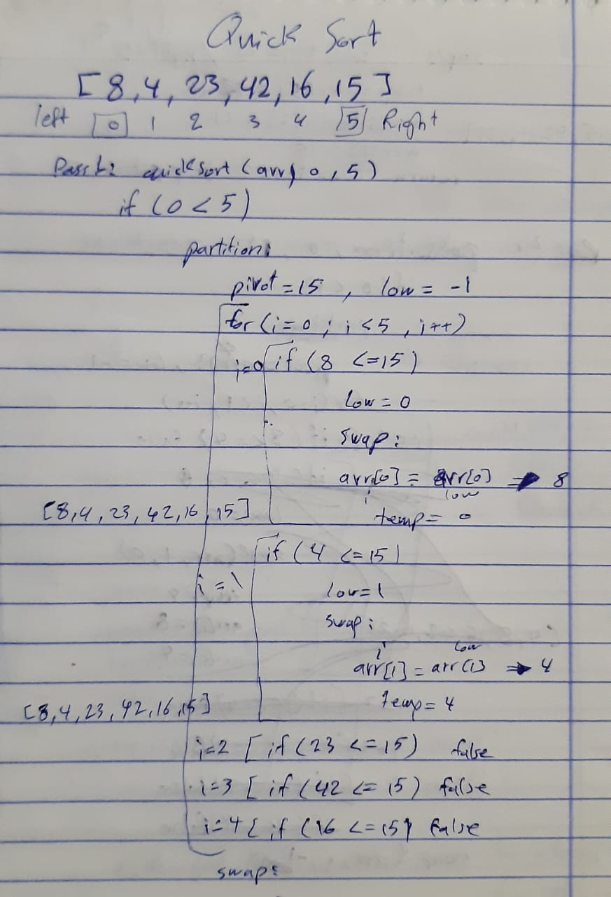

# Quick Sort
- QuickSort is a Divide and Conquer algorithm. It picks an element as pivot and partitions the given array around the picked pivot. 

## Challenge
- Review the pseudocode below, then trace the algorithm by stepping through the process with the provided sample array. Document your explanation by creating a blog article that shows the step-by-step output after each iteration through some sort of visual.

* Provide a visual step through for each of the sample arrays based on the provided pseudo code
* Convert the pseudo-code into working code in your language
* Present a complete set of working tests

## UML

