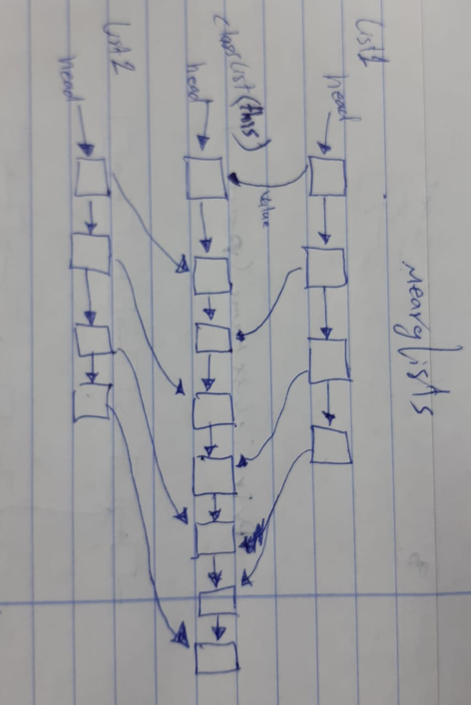

# Challenge Summary
<!-- Short summary or background information -->
Write a function merge to linked Lists into one as this:
`listOne = head -> [1] -> [3] -> [2] -> X`<br>
`listTwo = head -> [5] -> [9] -> [4] -> X`<br>
into this:<br>
`mergeLists = head -> [1] -> [5] -> [3] -> [9] -> [2] -> [4] -> X`.

## Challenge Description
<!-- Description of the challenge -->
Write a function called `mergeLists` which takes two linked lists as arguments. Zip the two linked lists together into one so that the nodes alternate between the two lists and return a reference to the head of the zipped list. You have access to the Node class and all the properties on the Linked List class as well as the methods created in previous challenges.

## Approach & Efficiency
<!-- What approach did you take? Why? What is the Big O space/time for this approach? -->
i started to assign each value of each list one at a time into main list created by class LinkedList

## Solution
<!-- Embedded whiteboard image -->
```
mergeLists(li1, li2) {
    let currentNode1 = li1.head;
    let currentNode2 = li2.head;

    while (currentNode1 || currentNode2) {
      if (currentNode1) {
        this.append(currentNode1.value);
        currentNode1 = currentNode1.next;
      }

      if (currentNode2) {
        this.append(currentNode2.value);
        currentNode2 = currentNode2.next;
      }
    }
    return this
  }
```

# UML


