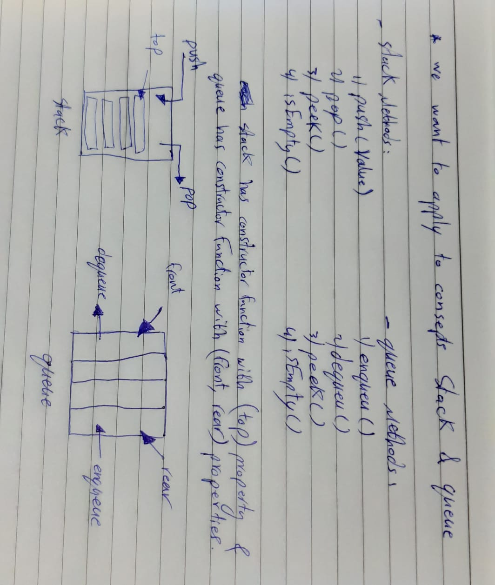

# Stacks and Queues
<!-- Short summary or background information -->
create `PseudoQueue` class qith these two methods `enqueue(value)` and `dequeue()`.

## Challenge
<!-- Description of the challenge -->
Create a brand new `PseudoQueue` class. this PseudoQueue class will implement our standard queue interface (the two methods listed below), but will internally only utilize 2 Stack objects. Ensure that you create your class with the following methods: 
1. `enqueue(value)` which inserts value into the PseudoQueue, using a first-in, first-out approach.
1. `dequeue()` which extracts a value from the PseudoQueue, using a first-in, first-out approach.

The `Stack` instances have only `push`, `pop`, and `peek` methods. 

## Approach & Efficiency
<!-- What approach did you take? Why? What is the Big O space/time for this approach? -->
and Big O of both Stack & Queue is O(n).

## UML
<!-- Description of each method publicly available to your Stack and Queue-->
